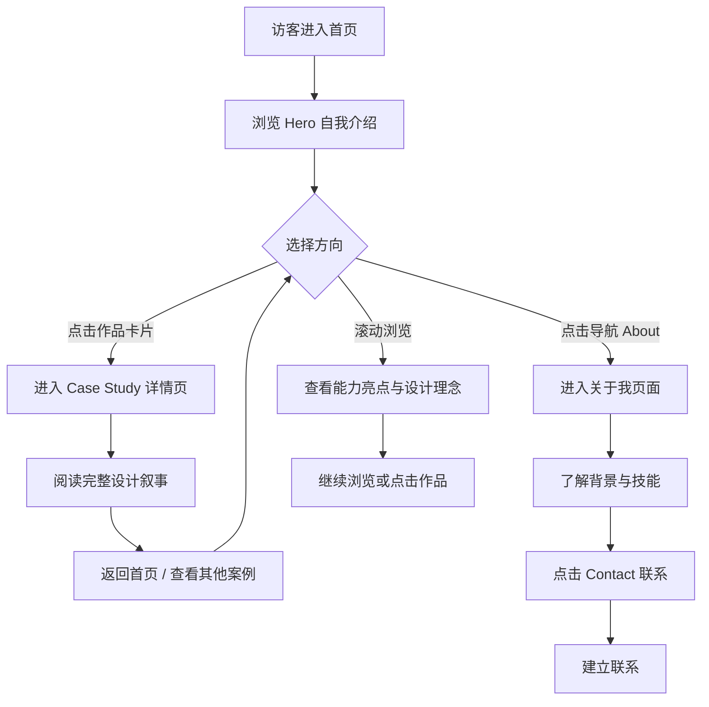

## 1. 产品概述

一个面向 B 端 AI & 交互设计师的个人作品集网站，用于沉淀设计作品、展示专业能力、呈现设计方法论与简历信息，并支持长期维护和内容更新。

- 目标用户：潜在雇主、合作方、同行设计师
- 核心价值：通过案例研究驱动的叙事方式，证明设计思维与业务影响力
- 风格定位：极简主义 + 暗色主题 + Bento Box 布局

## 2. 核心功能

### 2.1 功能模块

1. **首页 (Home)**：品牌导航、Hero 引导区、Bento Box 作品集预览、核心能力展示
2. **作品集详情 (Case Study)**：完整的案例研究叙事（问题→过程→方案→影响）
3. **关于我 (About)**：个人简介、技能矩阵、设计方法论、工作经历
4. **联系 (Contact)**：联系方式与社交渠道

### 2.2 页面详情

| 页面名称 | 模块名称 | 功能描述 |
|---------|---------|---------|
| 首页 | 顶部导航 | Logo + 导航菜单（Home / Work / About / Contact），滚动时毛玻璃效果 |
| 首页 | Hero 区 | 巨型字体自我介绍 + 动态光标 + 职业标签，核心信息一秒抓眼球 |
| 首页 | Bento 作品集 | 模块化网格展示 4-6 个精选项目，悬停显示项目摘要，点击进入详情 |
| 首页 | 能力亮点 | 3-4 个核心能力卡片（如 AI 产品设计、B 端 SaaS 经验、设计系统构建） |
| 首页 | 设计理念 | 简短的设计哲学陈述，强化个人品牌 |
| 首页 | Footer | 快速联系链接 + 社交入口 |
| Case Study | 项目概览 | 项目标题、角色、时间、客户、关键指标 |
| Case Study | 问题陈述 | 业务背景、用户痛点、设计挑战 |
| Case Study | 设计过程 | 调研→洞察→策略→迭代，附流程图/线框图 |
| Case Study | 最终方案 | 高保真界面展示 + 交互视频 |
| Case Study | 成果影响 | 数据化指标 + 业务价值 |
| About | 个人简介 | 头像 + 一句话介绍 + 完整 bio |
| About | 技能矩阵 | 设计技能 + 技术栈（Figma/Sketch/CSS 等） |
| About | 设计方法论 | 个人设计框架图示 |
| About | 工作经历 | 时间线形式展示职业历程 |
| Contact | 联系方式 | 邮箱、位置、LinkedIn、Dribbble、GitHub |

## 3. 核心流程

访客进入首页 → 通过 Hero 区了解设计师定位 → 浏览 Bento Box 精选项目 → 点击感兴趣的项目进入 Case Study 详情页深度了解 → 回到首页浏览 About 页面了解设计师背景 → 通过 Contact 页面建立联系

## 4. 用户界面设计

### 4.1 设计风格

- **主色调**：深黑 `#0A0A0B` 背景 + 纯白 `#F5F5F7` 文字
- **强调色**：电蓝 `#4F7FFF`（用于交互焦点、链接高亮）
- **辅助色**：中灰 `#6B6B70`（次级文字）、浅灰 `#1C1C1E`（卡片背景）
- **字体风格**：
  - Display: Space Grotesk — 独特几何感无衬线，用于巨型标题
  - Body: Inter — 精炼现代无衬线，用于正文
  - Mono: JetBrains Mono — 用于代码或数据指标展示
- **按钮风格**：圆角 12px，实心填充，悬停微缩放 + 发光效果
- **卡片风格**：圆角 20px，1px 边框 `#2C2C2E`，深色背景，悬停时边框亮起
- **图标风格**：极简线性图标，1.5px 线宽
- **布局风格**：桌面端 12 列网格 + Bento Box 不对称布局，大量留白
- **动效风格**：滚动触发渐入 + 悬停微交互 + 页面切换过渡

### 4.2 页面设计概览

| 页面名称 | 模块名称 | UI 元素 |
|---------|---------|---------|
| 首页 | Hero 区 | Space Grotesk 巨型字体（clamp 自适应），动态 Typewriter 效果，标签 pill |
| 首页 | Bento 作品集 | 不对称网格（大卡片 + 小卡片混合），悬停时卡片升起 + 封面图微缩放 + 边框高亮 |
| 首页 | 能力亮点 | 三列卡片，每项带 SVG 图标 + 短描述 |
| Case Study | 页面头部 | 项目封面大图 + 项目信息标签条 + 巨型项目名 |
| Case Study | 内容区 | 单列长文，大图穿插，流程图示，数据指标用等宽字体 |
| About | 个人简介 | 圆形头像 + 两侧不对称布局 |
| Contact | 联系表单 | 极简输入框，大提交按钮 |

### 4.3 响应式设计

- **桌面优先**：主要设计为 1440px 宽度
- **平板适配**：768px-1024px，Bento Box 降为 2 列
- **移动适配**：< 768px，单列垂直布局，导航收起为汉堡菜单
- **触控优化**：按钮最小 44px 点击区域

### 4.4 微交互细节

- 导航栏滚动时背景渐变 + 毛玻璃
- Hero 文字打字机效果
- 卡片悬停时 translateY(-4px) + 边框从 `#2C2C2E` 过渡到 `#4F7FFF`
- 页面加载时元素逐个渐入（staggered reveal）
- 滚动触发内容淡入（IntersectionObserver）
- 自定义光标（桌面端）
