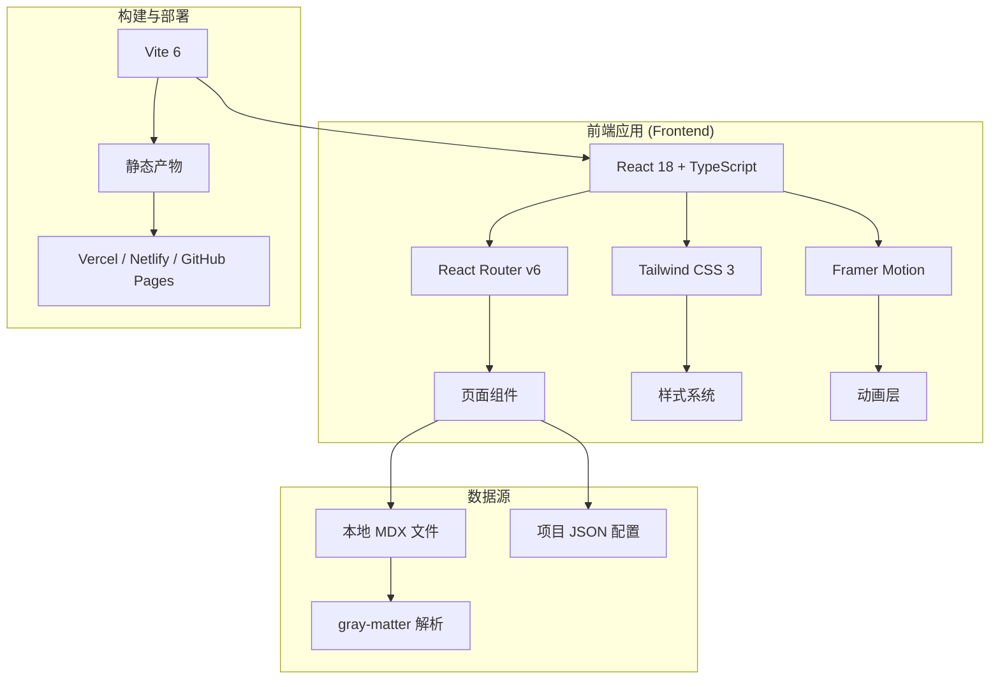

## 1. 架构设计



## 2. 技术选型

| 类别 | 技术 | 版本 | 选择理由 |
|------|------|------|---------|
| 框架 | React + TypeScript | 18 | 类型安全，生态成熟，适合长期维护 |
| 构建工具 | Vite | 6 | 极速冷启动，开发体验优秀 |
| 路由 | React Router | 6 | 声明式路由，支持动态参数（案例详情） |
| 样式 | Tailwind CSS | 3 | 原子化 CSS，暗色主题友好，快速迭代 |
| 动画 | Framer Motion | 11 | React 原生动画，支持滚动触发和复杂过渡 |
| 字体加载 | next/font/google (via @fontsource) | - | 自托管 Google Fonts，零 CLS |
| 内容管理 | MDX + JSON | - | 作品集案例用 MDX，站点配置用 JSON，纯文件方案无需后端 |

**不选择 CMS 的理由**：个人作品集更新频率低，文件式方案更轻量、可版本控制、部署简单。未来可平滑迁移到 Headless CMS。

## 3. 路由定义

| 路由 | 页面 | 说明 |
|------|------|------|
| `/` | 首页 | Hero + Bento 作品集预览 + 能力亮点 + 设计理念 |
| `/work` | 作品集列表 | 所有项目的网格视图，可按分类筛选 |
| `/work/:slug` | 案例详情页 | 完整 Case Study 叙事页 |
| `/about` | 关于我 | 个人介绍 + 技能 + 经历 |
| `/contact` | 联系方式 | 邮箱 + 社交链接 |

## 4. 项目结构

```
src/
├── components/          # 通用组件
│   ├── Layout/          # 布局组件（Header, Footer）
│   ├── Hero/            # Hero 区组件
│   ├── Bento/           # Bento Box 作品集组件
│   ├── Cards/           # 各类卡片组件
│   └── UI/              # 基础 UI 组件（Button, Badge 等）
├── pages/               # 页面组件
│   ├── Home.tsx
│   ├── Work.tsx
│   ├── CaseStudy.tsx
│   ├── About.tsx
│   └── Contact.tsx
├── data/                # 数据配置
│   ├── projects.json    # 项目列表
│   └── site.ts          # 站点配置（个人信息）
├── styles/              # 全局样式
│   ├── globals.css      # Tailwind 入口 + 自定义样式
│   └── animations.css   # 动画关键帧
├── hooks/               # 自定义 hooks
│   └── useScrollAnim.ts # 滚动触发动画 hook
├── content/             # MDX 案例内容
│   ├── example-project.mdx
│   └── ...
├── App.tsx
├── main.tsx
└── index.html
```

## 5. 数据模型

### 5.1 项目数据结构 (projects.json)

```typescript
interface Project {
  slug: string;
  title: string;
  subtitle: string;
  category: 'AI Product' | 'B2B SaaS' | 'Design System' | 'Mobile App' | 'Brand';
  year: number;
  role: string;
  client?: string;
  cover: string;          // 封面图 URL
  summary: string;        // 一句话摘要
  highlights: string[];   // 亮点标签
  metrics?: {             // 成果指标
    label: string;
    value: string;
    unit?: string;
  }[];
}
```

### 5.2 站点配置 (site.ts)

```typescript
interface SiteConfig {
  name: string;
  title: string;
  tagline: string;
  bio: string;
  email: string;
  location: string;
  social: {
    linkedin?: string;
    dribbble?: string;
    github?: string;
    twitter?: string;
  };
  skills: { category: string; items: string[] }[];
  experience: { year: string; role: string; company: string; desc?: string }[];
}
```

## 6. 设计系统配置 (Tailwind)

```typescript
// tailwind.config.js 关键配置
colors: {
  background: {
    DEFAULT: '#0A0A0B',
    card: '#1C1C1E',
    elevated: '#2C2C2E',
  },
  foreground: {
    DEFAULT: '#F5F5F7',
    muted: '#6B6B70',
    subtle: '#3A3A3C',
  },
  accent: {
    DEFAULT: '#4F7FFF',
    hover: '#6B93FF',
  },
}

fontFamily: {
  display: ['"Space Grotesk"', 'sans-serif'],
  body: ['Inter', 'sans-serif'],
  mono: ['"JetBrains Mono"', 'monospace'],
}

borderRadius: {
  'card': '20px',
  'button': '12px',
  'pill': '9999px',
}
```

## 7. 部署方案

**推荐 Vercel**（最简单，零配置）：
- Push 到 GitHub → 自动部署
- 支持自定义域名
- 内置 CDN，全球加速
- 免费版足够个人使用

**备选 GitHub Pages**：
- 完全免费
- 需配置 base path
- 自定义域名需额外 DNS 设置
